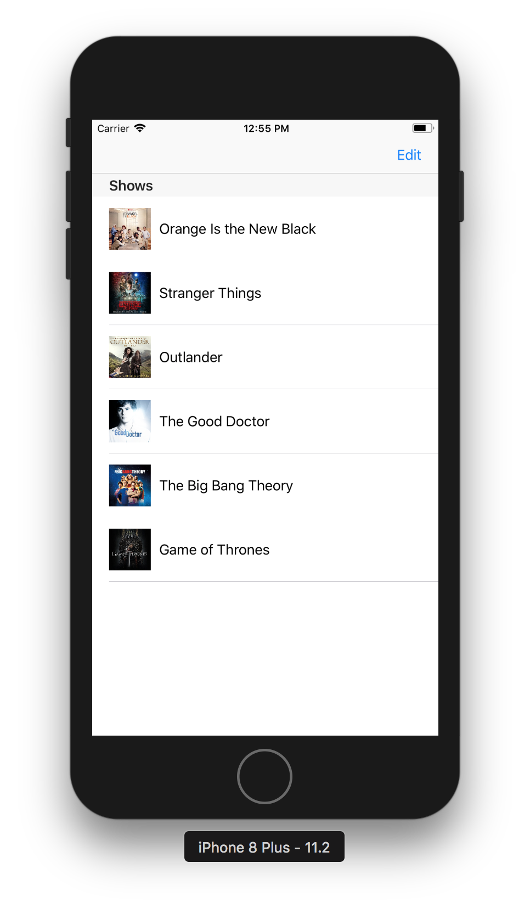
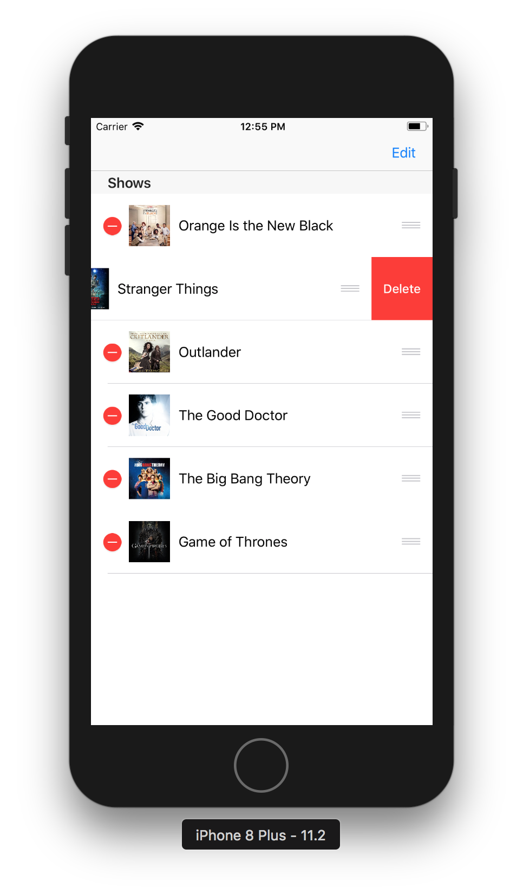
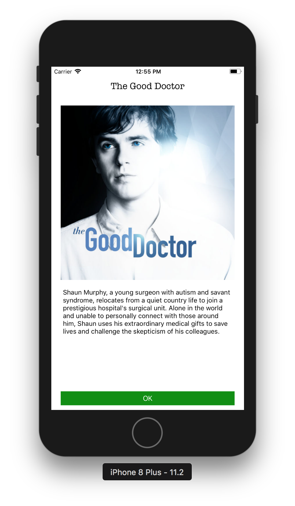

# iOSWorkshop
Women Who Code iOS Workshop Hosted by TD Bank

### Info
This workshop was created to teach beginners the basics of iOS development. We will explain how to use TableViews, ViewControllers, Delegates, Datasources and Storyboards throughout guide. We presented this workshop live on January 30th to Women Who Code and have created the Step By Step guide to help participants finish part 3. 

### Workshop Parts
The workshop code has been split into 3 parts. Each part builds on the previous one and can be used to help with fixing bugs along the way. 

### Data
For this workshop we will be using data from the Itunes API. we have including 2 ways to retrieve data in the Networking.swift file. For the workshop we will be using a slighly modified JSON stub from the Itnues API because we do not have enough time to cover it completely. We have included the live networking in a commented out function within that file which can be used to extend the project.  

### Resources 
If you are following the Step By Step guide to complete this workshop you will need to use the files from Tutorial Resources. Do not change the names of the swift, json or png files. Changing the names could create bugs and we have not provided details on how to fix them within the Step By Step guide.

### Part 1 Screenshot

### Part 2 Screenshot

### Part 3 Screenshot

